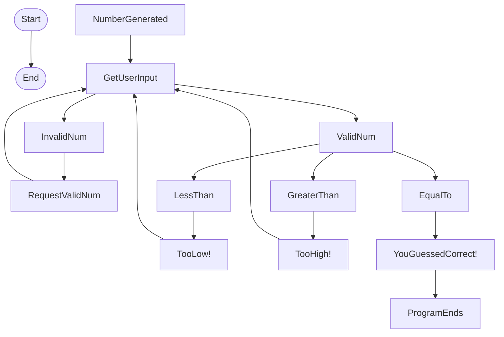

This flowchart was created to demonstrate a random guessing game in "Flowgorithm" where the computer randomly selects a number within a range, and the user guesses the number.
First, we have the computer generate the number, then we collect user input for guesses. If the user input is not a valid number, such as a letter or word, they are requested to provide a valid number and are redirected to UserInput.
If they provide a valid number, the program would then check to see if the guess is less than, greater than, or equal to the number generated.
If the input is less than or greater than, the user is provided with a message stating either TooLow! or TooHigh! and redirected to User Input.
If the input is correct, the program states that they are correct and then ends.